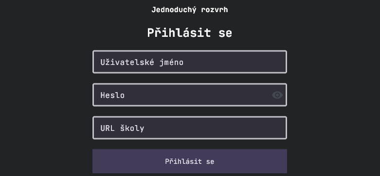
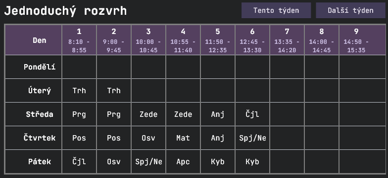

# Jednoduchý rozvrh / Simple timetable

Existuje už lepší alternativa Bakalářského rozvrhu, která má více funkcí a je komplexnější - Lepší rozvrh.  
Co kdyby ale existovala alternativa, která ve svém jádru je celkem.. jednoduchá aplikace?

# O aplikaci
Tuto aplikaci jsem vyvíjel hlavně jako jednodušší verzi Lepšího rozvrhu, která se jednoduše přihlásí do Bakalářské sítě a stáhne rozvrh, který jenom poté jednoduše zobrazí bez jakýchkoliv větších detailů.  
Jednoduchý rozvrh také podporuje vyhnutí se zadávání přihlašovacích údajů - můžete si sami zadat údaje rovnou ve zdrojovém kódu v souboru config.py a poté si celou aplikaci zkompilovat  
Pro příjemné používání doporučuji zobrazit rozvrh na zařízení, která jsou položena "na šířku" - v mém příkladě to byl chytrý budík s naflashovaným androidem.

# Vývoj aplikace
Aplikace byla napsána v pythonu za pomocí frameworku [Flet](https://flet.dev/), který poté python kód přeloží do flutter kódu a zkompiluje do .apk souboru. Díky Fletu jsem nemusel řešit učení se nového programovacího jazyku a mohl jsem vpořádku napsat celou aplikaci v jazyce, který už dobře znám.

# Funkce aplikace
- Možnost zadání údajů již v kódu (config.py) a poté zkompilování (flet build apk) - možnost vyhnutí se zadávání údajů v aplikaci
- Jednoduché a přehledné zobrazení rozvrhu na dnešní týden
- Jednoduché přihlášení bez řešení čehokoliv kolem
- Pěkný design s fontem JetBrains Mono
- Svobodný software - Žádné reklamy, žádné špehování, zdarma a navždy

# Screenshoty

